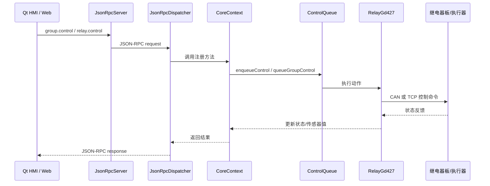
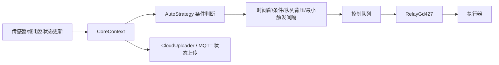
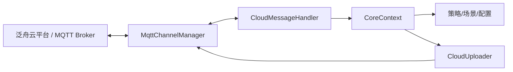

# 系统架构

本文档描述 `fanzhou_rpc_server` 当前工程架构。它覆盖服务端、Qt HMI、Web/Tauri 调试工具、JSON-RPC、设备通讯、云端 MQTT 和本地持久化。

## 总体架构

```mermaid
flowchart TB
    subgraph Client["客户端 / 操作界面"]
        QtApp["Qt HMI 客户端<br/>qt_app/src<br/>MainWindow + Home/Device/Group/Strategy/Sensor/Log/Settings/Monitor/Debug"]
        TestWeb["Web/Tauri 调试工具<br/>test_web"]
        ThirdParty["第三方 RPC 客户端"]
    end

    subgraph Server["fanzhou_rpc_server 核心服务"]
        Main["main.cpp<br/>服务启动入口"]
        Config["CoreConfig<br/>src/core/core_config*<br/>读取/保存 core.json"]
        Logger["Logger<br/>src/utils/logger<br/>core.log / error log"]
        Context["CoreContext<br/>src/core/core_context<br/>系统运行时上下文"]
    end

    subgraph RpcLayer["RPC 接入层"]
        JsonServer["JsonRpcServer<br/>src/rpc/json_rpc_server<br/>默认端口 12345"]
        Dispatcher["JsonRpcDispatcher<br/>src/rpc/json_rpc_dispatcher<br/>JSON-RPC 方法分发/统计"]
        Registry["RpcRegistry<br/>src/core/rpc_registry*<br/>注册 rpc/sys/can/relay/group/auto/device/mqtt/config/monitor/auth/scene"]
        DeviceTcpServer["DeviceTcpServer<br/>src/rpc/device_tcp_server<br/>设备协议 TCP Server :9000"]
        DeviceTcpRpc["DeviceTcp RPC<br/>src/rpc/device_tcp_rpc<br/>device.tcp.*"]
    end

    subgraph Runtime["CoreContext 管理的运行时对象"]
        Settings["SystemSettings<br/>系统设置"]
        Monitor["SystemMonitor<br/>资源监控"]
        Auth["AuthConfig / Token<br/>认证与白名单"]
        Groups["设备分组<br/>deviceGroups / groupNames / groupChannels"]
        Strategies["自动策略<br/>AutoStrategy / AutoStrategyState"]
        Sensors["传感器运行时数据<br/>sensorValues / sensorUpdateTime"]
        Relays["继电器设备表<br/>relays: node -> RelayGd427"]
        ControlQueue["控制队列<br/>enqueueControl / queueGroupControl"]
    end

    subgraph DeviceLayer["设备与通讯层"]
        CanComm["CanComm<br/>src/comm/can<br/>SocketCAN"]
        SerialComm["SerialComm<br/>src/comm/serial<br/>RS485/UART"]
        CanManager["CanDeviceManager<br/>src/device/can"]
        RelayGd427["RelayGd427<br/>GD427 继电器驱动<br/>CAN / TCP Client 双通道"]
        ModbusSensor["Modbus Sensor<br/>src/device/modbus"]
        SerialSensor["Serial Sensor<br/>src/device/serial"]
        UartSensor["UART Sensor<br/>src/device/uart"]
    end

    subgraph Field["现场设备 / 大棚硬件"]
        CanBus["CAN 总线"]
        CanRelayBoard["CAN GD427 继电器板"]
        TcpControlBoard["TCP 控制板/继电器板"]
        Actuators["执行器<br/>风机 / 顶卷 / 端面卷膜 / 侧卷膜 / 湿帘 / 水泵 / 阀组"]
        SensorHW["传感器<br/>温度 / 湿度 / CO2 / 光照 / 水分 / 水位 / 风雨"]
    end

    subgraph CloudLayer["云平台 / MQTT"]
        MqttManager["MqttChannelManager<br/>src/cloud/mqtt"]
        MqttClient["MqttClient<br/>多通道 MQTT"]
        CloudHandler["CloudMessageHandler<br/>云端命令/场景同步"]
        CloudUploader["CloudUploader<br/>设备状态/传感器上传"]
        CloudSetting["SettingService<br/>云端配置同步"]
        FanZhouCloud["泛舟云平台 / MQTT Broker"]
    end

    subgraph Storage["本地持久化"]
        CoreJson["/var/lib/fanzhou_core/core.json<br/>设备/分组/策略/通讯/云配置"]
        CoreLog["/var/log/fanzhou_core/core.log"]
        ErrorLog["错误日志"]
    end

    QtApp -- "JSON-RPC" --> JsonServer
    TestWeb -- "JSON-RPC 调试" --> JsonServer
    ThirdParty -- "JSON-RPC" --> JsonServer

    Main --> Config
    Main --> Logger
    Main --> Context
    Main --> Registry
    Main --> JsonServer
    Main --> DeviceTcpServer

    Registry --> Dispatcher
    JsonServer --> Dispatcher
    DeviceTcpRpc --> Dispatcher
    DeviceTcpRpc --> DeviceTcpServer
    DeviceTcpServer --> Context
    Dispatcher --> Context

    Context --> Settings
    Context --> Monitor
    Context --> Auth
    Context --> Groups
    Context --> Strategies
    Context --> Sensors
    Context --> Relays
    Context --> ControlQueue

    Context --> CanComm
    Context --> CanManager
    Context --> SerialComm
    CanManager --> RelayGd427
    Relays --> RelayGd427
    ControlQueue --> RelayGd427
    RelayGd427 --> CanComm

    SerialComm --> SerialSensor
    SerialComm --> ModbusSensor
    SerialComm --> UartSensor
    ModbusSensor --> Sensors
    SerialSensor --> Sensors
    UartSensor --> Sensors

    CanComm <--> CanBus
    CanBus <--> CanRelayBoard
    CanRelayBoard --> Actuators
    RelayGd427 --> DeviceTcpServer
    DeviceTcpServer <--> TcpControlBoard
    TcpControlBoard --> Actuators
    SensorHW --> ModbusSensor
    SensorHW --> SerialSensor
    SensorHW --> UartSensor

    Context --> MqttManager
    MqttManager --> MqttClient
    MqttClient <--> FanZhouCloud
    Context --> CloudHandler
    Context --> CloudUploader
    Context --> CloudSetting
    CloudHandler <--> MqttManager
    CloudUploader --> MqttManager
    CloudSetting <--> MqttManager
    FanZhouCloud -- "云端命令 / 策略 / 设置" --> CloudHandler
    CloudUploader -- "遥测上传" --> FanZhouCloud

    Config <--> CoreJson
    Context -- "saveConfig / reloadConfig / exportConfig" --> CoreJson
    Logger --> CoreLog
    Logger --> ErrorLog
```

## 启动链路

1. `main.cpp` 创建 `QCoreApplication`。
2. `CoreConfig` 读取 `/var/lib/fanzhou_core/core.json`，失败时写入默认配置。
3. 初始化 `Logger`。
4. 创建 `CoreContext` 和 `DeviceTcpServer`，互相注入依赖。
5. `CoreContext::init()` 初始化系统设置、监控、CAN、设备、传感器、MQTT、云服务、策略和运行时状态。
6. `RpcRegistry::registerAll()` 注册 JSON-RPC 方法。
7. `JsonRpcServer` 监听 `main.rpcPort`，默认 `12345`。
8. `DeviceTcpServer` 监听 `9000`，等待控制板作为 TCP Client 接入。

## 关键数据流

### 手动控制

### 自动策略

### 云端同步

## 模块边界

| 层 | 目录 | 职责 |
|---|---|---|
| 启动/装配 | `main.cpp` | 配置、日志、上下文、RPC、TCP 设备服务启动 |
| 核心上下文 | `src/core` | 配置、运行时状态、分组、策略、认证、RPC 注册 |
| RPC | `src/rpc` | JSON-RPC 服务、方法分发、TCP 控制板 RPC |
| 通讯 | `src/comm` | CAN、串口通讯适配 |
| 设备 | `src/device` | 继电器、CAN 设备管理、串口/Modbus/UART 传感器 |
| 云端 | `src/cloud` | MQTT 多通道、泛舟云协议、上传、配置同步 |
| 工具 | `src/utils` | 日志、系统设置、系统监控、USB 监控 |
| HMI | `qt_app` | 1024x600 触屏客户端和页面组件 |
| 调试 | `test_web`, `scripts` | Web/Tauri 调试和 RPC 冒烟测试 |

## 重要端口和文件

| 项 | 默认值 |
|---|---|
| JSON-RPC 端口 | `12345` |
| 设备 TCP Server 端口 | `9000` |
| 配置文件 | `/var/lib/fanzhou_core/core.json` |
| 主日志 | `/var/log/fanzhou_core/core.log` |
| 服务端项目 | `fanzhou_rpc_server.pro` |
| Qt HMI 项目 | `qt_app/qt_app.pro` |
